My detailed walkthrough of the course "Introduction to Linux"

## Objective

To get acquainted with the Linux operating system and its basic capabilities.

## Assignments

1. Introduction
2. General information about the course
3. How to install Linux
4. Mastering Linux
5. Terminal: the basics
6. Launching executable files
7. Input / output
8. Downloading files from the Internet
9. Working with archives
10. Searching for files and words in files
11. Working on the server
12. Getting to know the server
13. Sharing files
14. Launching applications
15. Controlling launched programs
16. Multithreaded applications
17. Terminal manager tmux
18. How to install Linux: an extended guide
19. Advanced topics
20. Text editor vim
21. Bash scripting: the basics
22. Bash scripting: branches and loops
23. Bash scripting: miscellaneous
24. Advanced search and editing
25. Plotting graphs in gnuplot
26. Miscellaneous

## Stage 1

In the first stage of the external course, I had to: review general information, review methods for installing Linux, master Linux, launch Terminal, and also study several basic commands for working in it, review launching executable files, review input/output, review downloading files from the Internet, review working with archives, review methods for searching for files, and answer test questions.

**After reviewing the general information, I had to answer the following test questions:**

# Task 1.1.3

# Task 1.1.5

**After reviewing the methods for installing Linux, I had to answer the following test questions:**

# Task 1.2.6

# Task 1.2.8

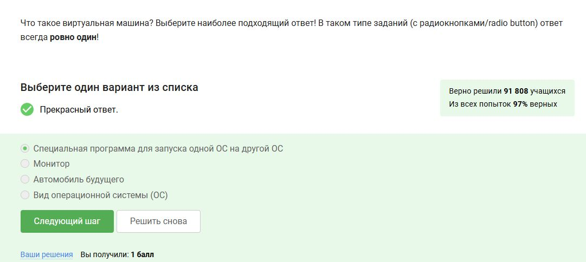

# Task 1.2.10

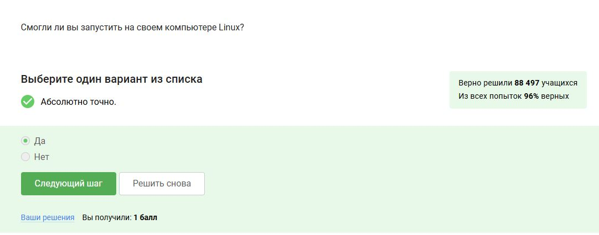

**After mastering Linux, I had to answer the following test questions:**

# Task 1.3.4

# Task 1.3.6

# Task 1.3.8

# Task 1.3.10

**After launching Terminal and learning a few basic commands to work in it, I had to answer the following test questions:**

# Task 1.4.3

# Task 1.4.5

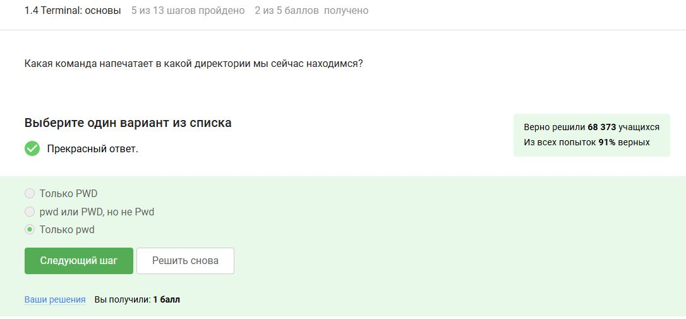

# Task 1.4.7

# Task 1.4.10

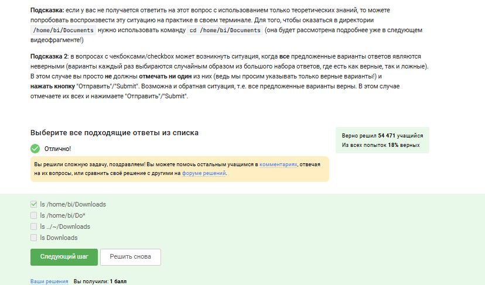

# Task 1.4.12

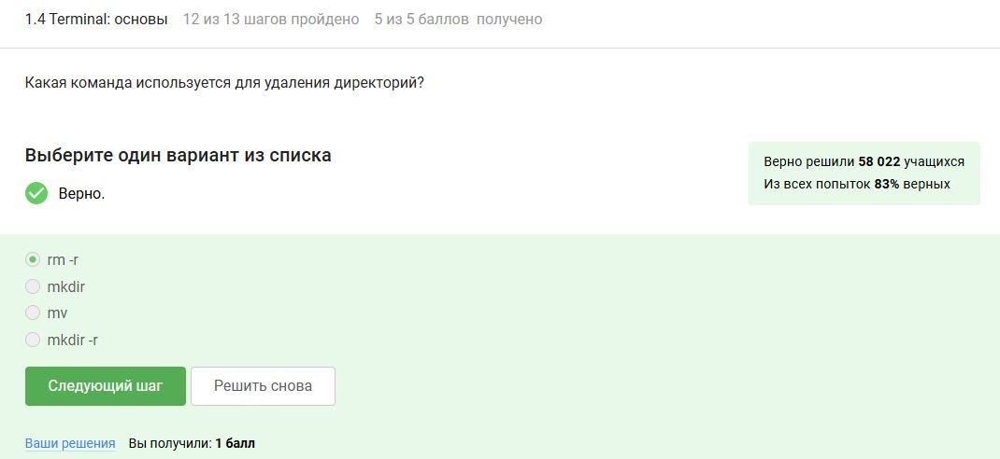

**After viewing the launch of executable files, I had to answer the following test questions:**

# Task 1.5.3

# Task 1.5.6

# Task 1.5.7

**After viewing the input/output, I had to answer the following test questions:**

# Task 1.6.4

# Task 1.6.5

# Task 1.6.8

**After viewing the download of files from the Internet, I had to answer the following test questions:**

# Task 1.7.3

# Task 1.7.5

# Task 1.7.7

**After reviewing the work with archives, I had to answer the following test questions:**

# Task 1.8.3

# Task 1.8.5

# Task 1.8.7

**After reviewing the methods for searching files and words, I had to answer the following test questions:**

# Task 1.9.3

# Task 1.9.5

# Task 1.9.6

**I have completed the first stage of the external course and have started the second stage.**

## Stage 2

In In the second stage of the external course I had to: get acquainted with the server, consider file exchange, consider launching applications, consider control of launched applications, get acquainted with multi-threaded applications, get acquainted with the tmux Terminal Manager and answer test questions.

**After getting to know the server, I had to answer the following test questions:**

# Task 2.1.3

# Task 2.1.6

**After viewing the file exchange, I had to answer the following test questions:**

# Task 2.2.4

# Task 2.2.6

# Task 2.2.8

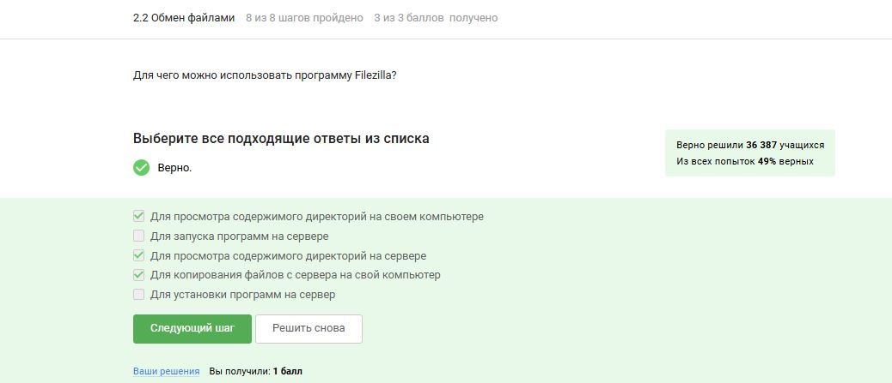

**After viewing the application launch, I had to answer the following test questions:**

# Task 2.3.4

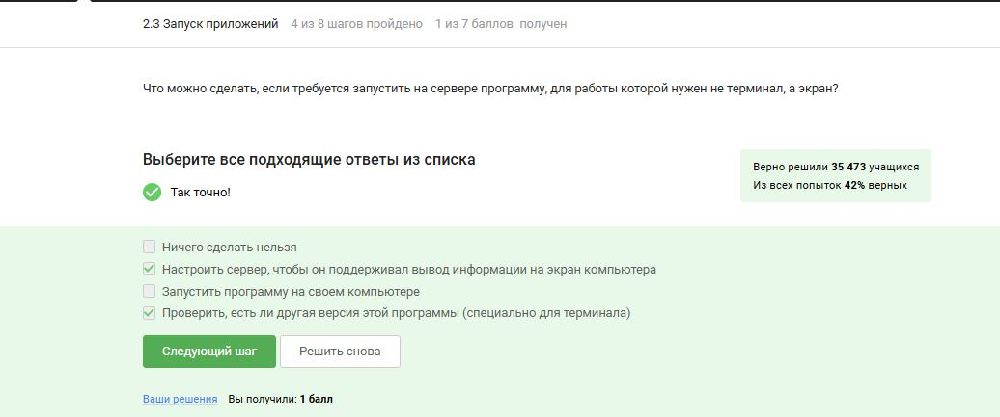

# Task 2.3.6

# Task 2.3.7

# Task 2.3.8

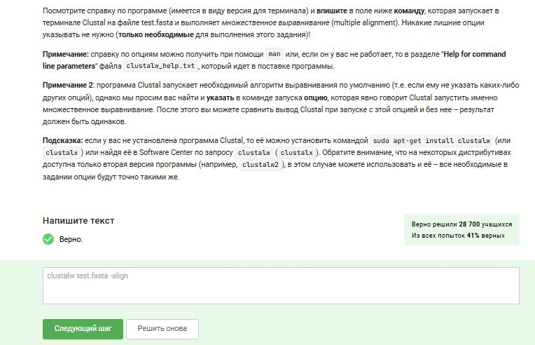

**After reviewing the application launch control, I had to answer the following test questions:**

# Task 2.4.5

# Task 2.4.8

# Task 2.4.10

# Task 2.4.11

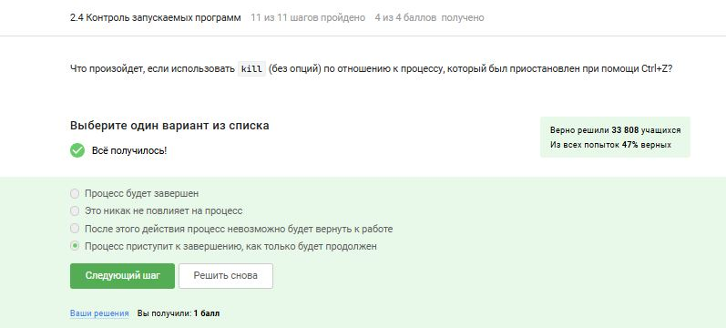

**After reviewing multithreaded applications, I had to answer the following test questions:**

# Task 2.5.7

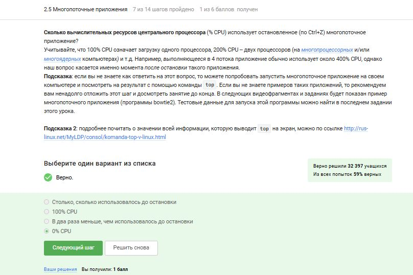

# Task 2.5.8

# Task 2.5.9

# Task 2.5.12

# Task 2.5.13

**After getting acquainted with the tmux Terminal Manager, I had to answer the following test questions:**

# Task 2.6.5

# Task 2.6.10

# Task 2.6.14

# Task 2.6.15

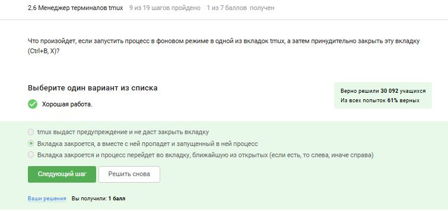

# Task 2.6.18

# Task 2.6.19

**I have completed the second stage of the external course and have started the third stage.**

## Stage 3

In the third stage of the external course, I had to: get acquainted with the vim text editor, get acquainted with the basics of bash scripts, study bash scripts: branches and loops, study bash scripts: miscellaneous, study advanced search and editing, study plotting in gnuplot, study the Miscellaneous section and answer test questions.

**After getting acquainted with the vim Text Editor, I had to answer the following test questions:**

# Task 3.1.5

# Task 3.1.7

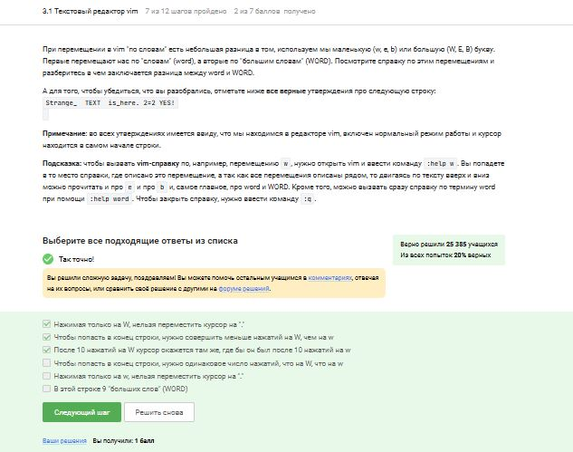

# Task 3.1.8

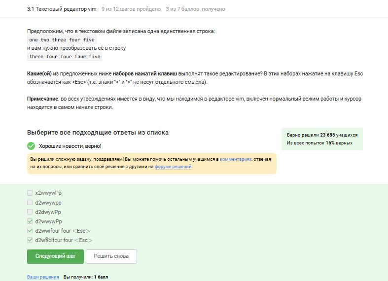

# Task 3.1.10

# Task 3.1.11

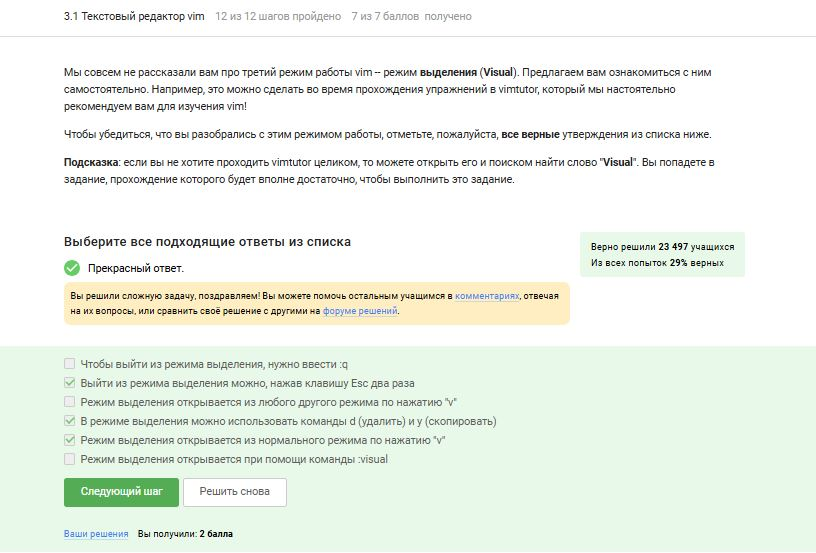

**After getting acquainted with the basics of bash scripting, I had to answer the following test questions:**

# Task 3.2.3

# Task 3.2.5

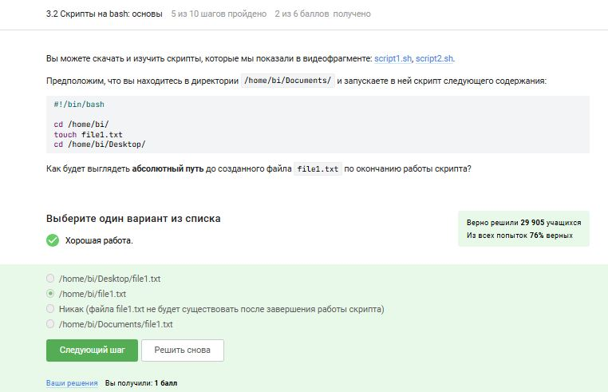

# Task 3.2.7

# Task 3.2.10

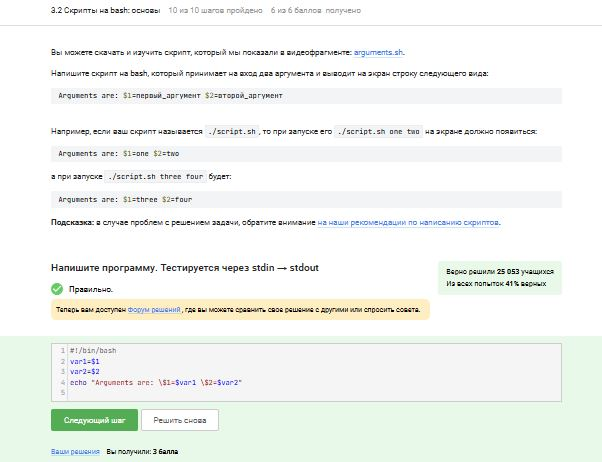

**After studying bash scripts: branches and loops, I had to answer the following test questions:**

# Task 3.3.3

# Task 3.3.5

# Task 3.3.6

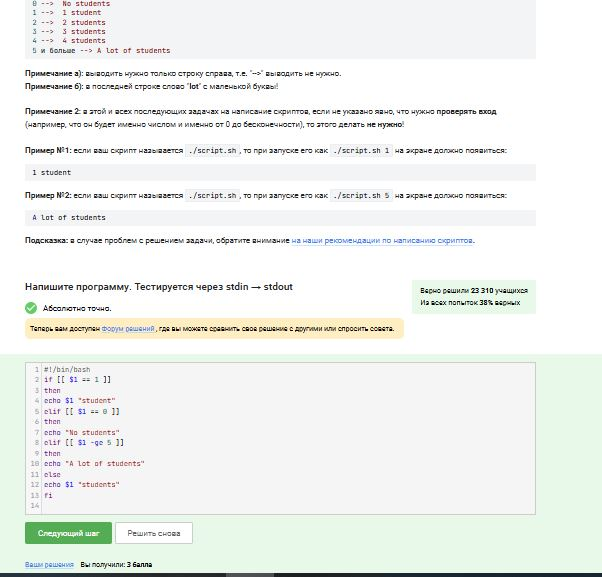

# Task 3.3.8

# Task 3.3.9

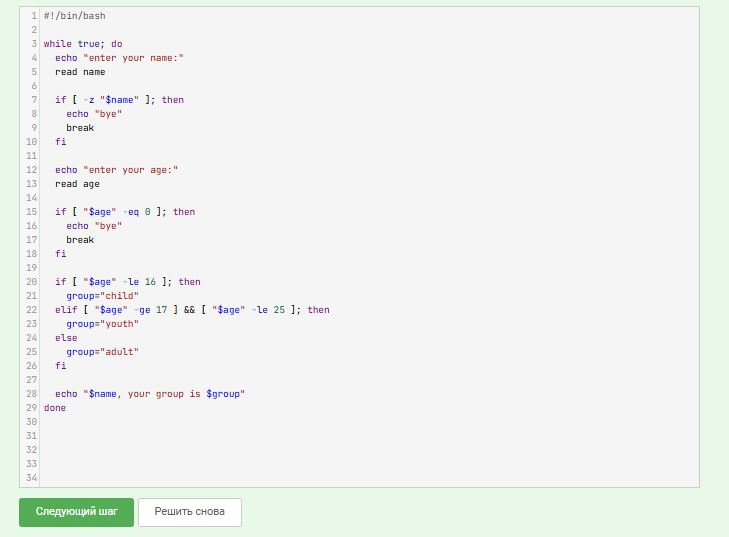

**After studying bash scripts: miscellaneous, I had to answer the following test questions:**

# Task 3.4.3

# Task 3.4.5

# Task 3.4.6

# Task 3.4.8

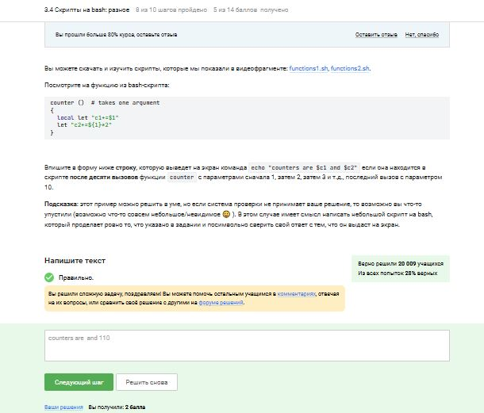

# Task 3.4.9

# Task 3.4.10

**After learning advanced search and editing, I had to answer the following test questions:**

# Task 3.5.3

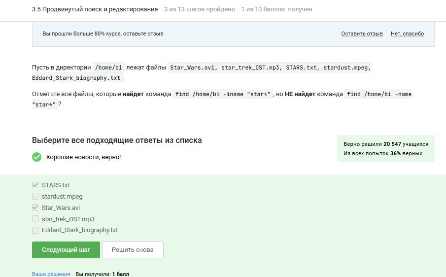

# Task 3.5.4

# Task 3.5.5

# Task 3.5.7

# Task 3.5.9

# Task 3.5.11

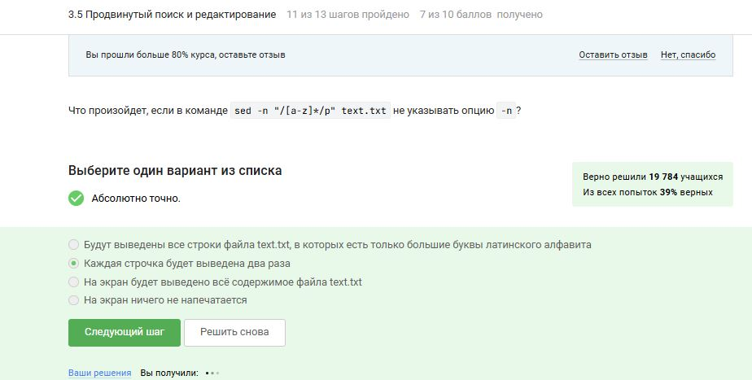

# Task 3.5.12

**After learning how to plot in gnuplot, I had to answer the following test questions:**

# Task 3.6.3

# Task 3.6.5

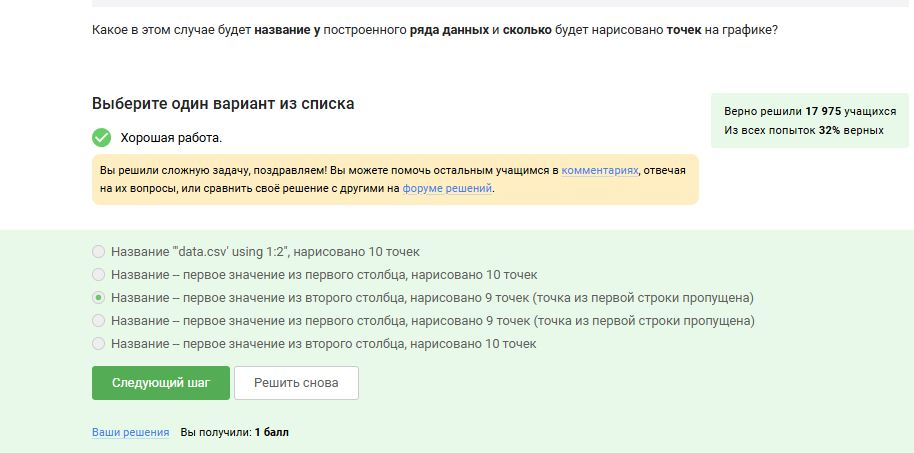

# Task 3.6.7

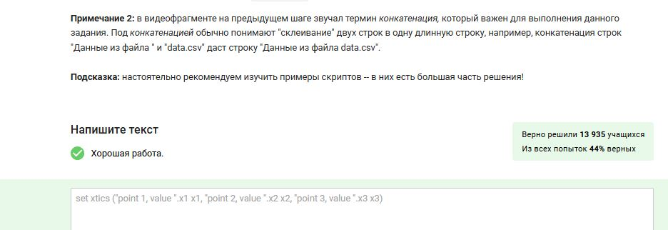

# Task 3.6.10

**After studying the Miscellaneous section, I had to answer the following test questions:**

# Task 3.7.4

# Task 3.7.5

# Task 3.7.7

# Task 3.7.8

# Task 3.7.10

## Summary

**I completed the external course and received a certificate with honors**

## Conclusion

I got acquainted with the Linux operating system and its basic capabilities.

## References

1. http://rus-linux.net/  -- виртуальная энциклопедия Linux 
2. http://www.f-notes.info/linux:linux_command -- довольно обширный список полезных команд терминала.
3. http://ru.najomi.org/_nix -- полезные примеры использования команд терминала
4. http://forum.ubuntu.ru/ -- форум русскоязычного сообщества Ubuntu.
5. http://ru.najomi.org/vim -- команды vim
6. http://lib.ru/LINUXGUIDE/torvalds_jast_for_fun.txt -- книга создателя Linux Линуса Торвальдса "Just for fun".

## My certificate

Link: https://stepik.org/cert/2791854

## Video for passing

You can also watch my passing of the external course on my channels:

**Rutube:** https://rutube.ru/channel/57162217/

**plvideo:** https://plvideo.ru/@0Z9TEc1ngakg
